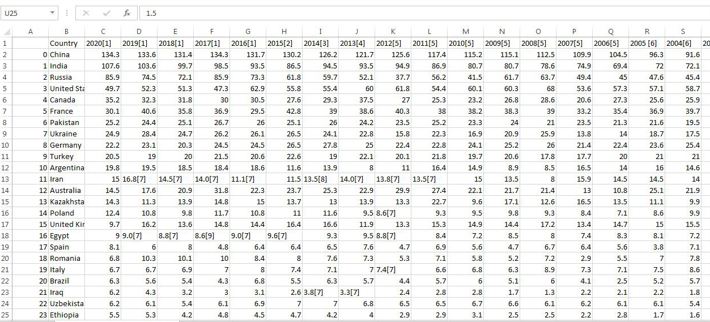

# Wheat Production Analysis

---

## Background
This project stems from my recent firsthand experience in mills where wheat is transformed into flour and various other products. This fueled my curiosity, prompting me to embark on a journey to delve into the global scale of wheat cultivation and production. Through this exploration, I aim to uncover insightful, data-driven revelations about wheat kernel.

## About dataset
The quantities of wheat in the following table are in million metric tonnes. All countries with a typical production quantity of at least 2 million metric tonnes are listed below. It contains 42 rows and 27 columns. click  [here](https://www.kaggle.com/datasets/rajkumarpandey02/wheat-production-statistics) to read more about the data.

## Inquiries for Analysis
1. Identifying the Top Wheat Producers by Country
2. Determining Leading Wheat Producers by Continent
3. Analyzing Time-Series Data for Different Countries
4. Total Wheat Produced per Year
5. Year-over-year Production Analysis

## Skills demonstrated
  - Data Wrangling with Excel
  - Lookup functions
  - Filters
  - Data visualization with Power BI
  - Data Modelling
  - DAX

## Data Cleaning
   After checking for duplicates, data inconsistencies were resolved using the 'Find and Replace' function. I also effectively used filters to isolate specific subsets for analysis. 
   
   In an effort to streamline the dataset, I identified and removed irrelevant columns. For added context, I integrated a 'Continent' column using the 'VLOOKUP' function. This enrichment enhanced the analysis by providing valuable geographic insights. 

   Cleaned data            |     Raw data
   :----------------------:|:---------------:
     | 

## Data Visualization
  The Visualization was done with Power BI Desktop.
    Click [here](https://app.powerbi.com/view?r=eyJrIjoiOThmZmZmNjMtNzU4Yi00MjkyLThjYjItZDdjOWM2NzMwMTdkIiwidCI6IjI5ZWRjNWZjLTE2NGYtNGJmZC1hZTIxLTllY2M0MDc1ZDZmOSJ9)  to interact with the dashoad   

